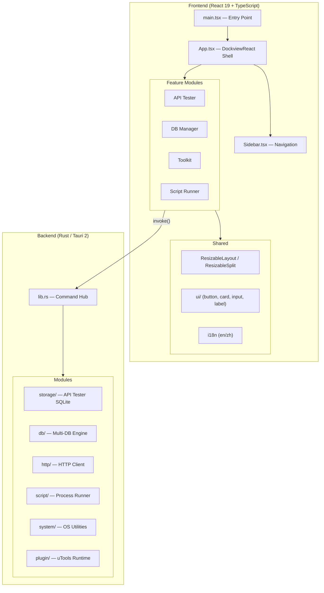
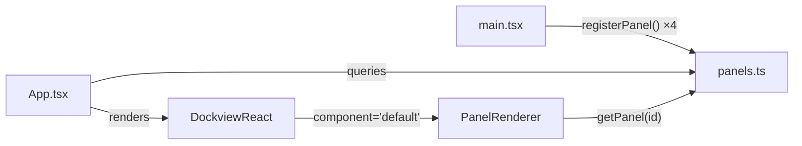
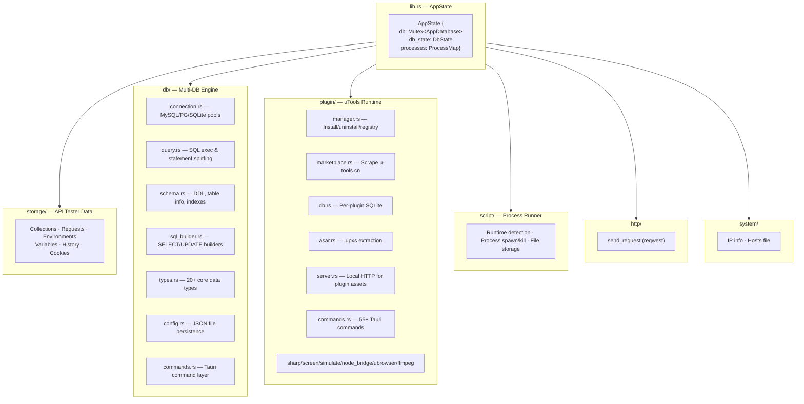
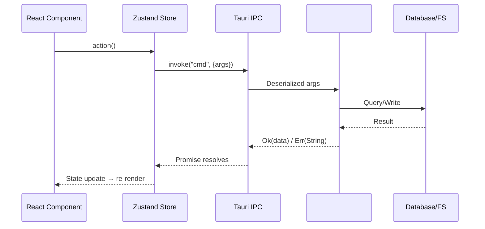
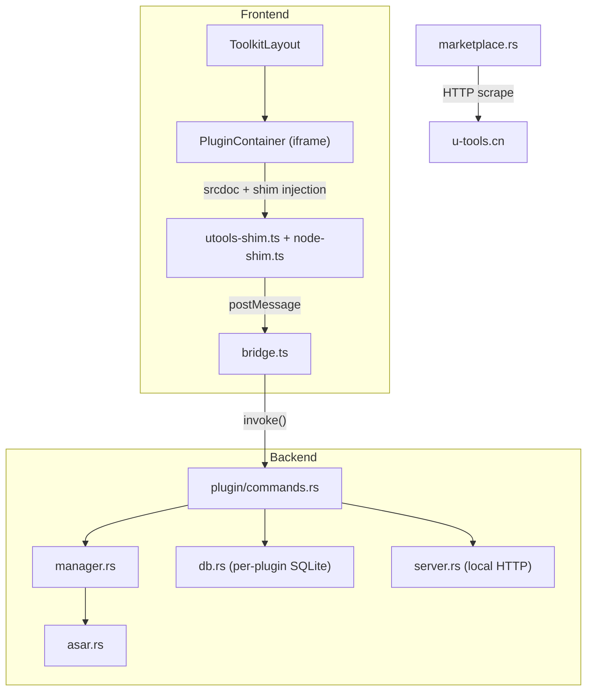

# System Architecture

## High-Level Architecture

Pandora is a Tauri 2 desktop app with a Rust backend and React frontend, following a modular panel-based architecture.



## Frontend Architecture

### Panel System (Two-Layer Layout)

1. **Top-level**: `dockview-react` manages module tabs (drag, split, rearrange)
2. **Module-internal**: Custom `ResizableLayout` / `ResizableSplit` for sidebars and split panes



### State Management

Each module owns its state via Zustand stores. No global Redux-style store.

| Store | Scope | Persistence |
|-------|-------|-------------|
| `useThemeStore` | Global | localStorage `pandora-theme` |
| `useLayoutStore` | Global | localStorage `pandora-layout` |
| `useI18nStore` | Global | localStorage `pandora-locale` |
| `api-tester/store.ts` | Module | Tauri backend (SQLite) |
| `api-tester/stores/tabs.ts` | Module | In-memory |
| `api-tester/stores/settings.ts` | Module | localStorage |
| `db-manager/store/index.ts` | Module | Tauri backend (JSON files) |
| `toolkit/stores/plugin-store.ts` | Module | Tauri backend (JSON + SQLite) |
| `script-runner/store.ts` | Module | Tauri backend (filesystem) |

### Module Structure Convention

```
src/modules/<name>/
├── <Name>.tsx           # Main component
├── <Name>Panel.tsx      # Dockview wrapper (thin)
├── store.ts             # Zustand store
├── stores/              # Additional stores (optional)
├── components/          # Sub-components
├── utils/               # Pure utility functions
├── hooks/               # Custom React hooks (optional)
├── lib/                 # Non-React libraries (optional)
└── styles/              # CSS modules (optional)
```

## Backend Architecture

### Module Responsibility Map



### Data Persistence Strategy

| Data | Storage | Location |
|------|---------|----------|
| API collections, requests, envs, cookies, history | SQLite (AppDatabase) | `~/.pandora/pandora.db` |
| DB Manager connections, favorites, query history | JSON files (FileConfigStore) | `~/.pandora/db-manager/` |
| Plugin registry | JSON file | `~/.pandora/plugins/registry.json` |
| Plugin data (utools.db) | Per-plugin SQLite | `~/.pandora/plugins/<id>/utools.db` |
| Script files | Filesystem | `~/.pandora/scripts/` |
| Dockview layout, theme, locale | localStorage | Browser storage |

## Communication Pattern



## Plugin System Architecture


