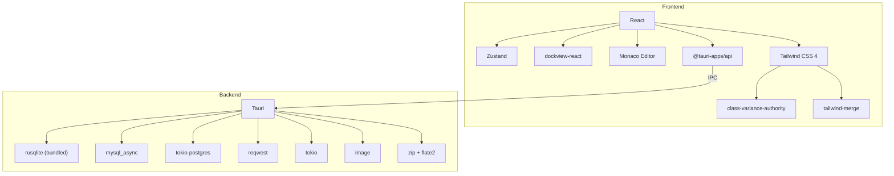

# Dependencies

## Rust Dependencies (Cargo.toml)

### Core Framework
| Crate | Version | Purpose |
|-------|---------|---------|
| `tauri` | 2 | Desktop app framework (IPC, window, system tray) |
| `tauri-plugin-opener` | 2 | Open URLs/files with system default |
| `tauri-plugin-dialog` | 2 | Native file/save dialogs |
| `tauri-plugin-fs` | 2 | Filesystem access from frontend |
| `tauri-build` | 2 | Build-time code generation |

### Data & Serialization
| Crate | Version | Purpose |
|-------|---------|---------|
| `serde` | 1 (derive) | Serialization framework |
| `serde_json` | 1 | JSON serialization |
| `chrono` | 0.4 (serde) | Date/time handling |
| `uuid` | 1.0 (v4, serde) | UUID generation |

### Database
| Crate | Version | Purpose |
|-------|---------|---------|
| `rusqlite` | 0.32 (bundled) | SQLite (app data + plugin data) |
| `mysql_async` | 0.34 | MySQL async driver |
| `tokio-postgres` | 0.7 | PostgreSQL async driver |

### Networking
| Crate | Version | Purpose |
|-------|---------|---------|
| `reqwest` | 0.12 (json) | HTTP client |
| `urlencoding` | 2 | URL encoding for marketplace |

### Async Runtime
| Crate | Version | Purpose |
|-------|---------|---------|
| `tokio` | 1 (full) | Async runtime |
| `async-trait` | 0.1 | Async trait support |

### File Processing
| Crate | Version | Purpose |
|-------|---------|---------|
| `zip` | 2 | ZIP archive extraction (plugin install) |
| `flate2` | 1 | Gzip decompression |
| `byteorder` | 1 | Binary parsing (asar format) |
| `base64` | 0.22 | Base64 encoding/decoding |

### Image & Media
| Crate | Version | Purpose |
|-------|---------|---------|
| `image` | 0.25 | Image processing (sharp API) |

### System
| Crate | Version | Purpose |
|-------|---------|---------|
| `dirs` | 5 | Platform-specific directories |
| `hex` | 0.4 | Hex encoding |
| `log` | 0.4 | Logging facade |
| `thiserror` | 1.0 | Error derive macros |

### Windows-Only
| Crate | Version | Purpose |
|-------|---------|---------|
| `winapi` | 0.3 | Windows API (input simulation, screen capture, DPI) |

## Frontend Dependencies (package.json)

### Core
| Package | Version | Purpose |
|---------|---------|---------|
| `react` | ^19.1.0 | UI framework |
| `react-dom` | ^19.1.0 | DOM renderer |
| `zustand` | ^5.0.11 | State management |
| `dockview-react` | ^4 | IntelliJ-style panel system |

### Tauri Integration
| Package | Version | Purpose |
|---------|---------|---------|
| `@tauri-apps/api` | ^2 | Core IPC (invoke, events) |
| `@tauri-apps/plugin-dialog` | ^2.6.0 | Native dialogs |
| `@tauri-apps/plugin-fs` | ^2.4.5 | Filesystem access |
| `@tauri-apps/plugin-opener` | ^2 | Open URLs/files |

### Editor & Formatting
| Package | Version | Purpose |
|---------|---------|---------|
| `@monaco-editor/react` | ^4.7.0 | Monaco editor React wrapper |
| `monaco-editor` | ^0.52.0 | Code editor (SQL, JSON, scripts) |
| `sql-formatter` | ^15.7.2 | SQL formatting |

### Styling
| Package | Version | Purpose |
|---------|---------|---------|
| `tailwindcss` | ^4 | Utility-first CSS |
| `@tailwindcss/vite` | ^4 | Vite plugin for Tailwind |
| `tailwind-merge` | ^3.5.0 | Merge Tailwind classes |
| `class-variance-authority` | ^0.7.1 | Component variant system |
| `clsx` | ^2.1.1 | Conditional classnames |

### UI Primitives
| Package | Version | Purpose |
|---------|---------|---------|
| `@radix-ui/react-label` | ^2.1.8 | Accessible label |
| `@radix-ui/react-slot` | ^1.2.4 | Polymorphic component slot |

### Data Processing
| Package | Version | Purpose |
|---------|---------|---------|
| `js-yaml` | ^4.1.1 | YAML parsing (Swagger import) |

### Dev Dependencies
| Package | Version | Purpose |
|---------|---------|---------|
| `typescript` | ~5.8.3 | Type checking |
| `vite` | ^7.0.0 | Build tool |
| `@vitejs/plugin-react` | ^4.6.0 | React fast refresh |
| `@tauri-apps/cli` | ^2 | Tauri CLI |
| `@types/react` | ^19.1.0 | React type definitions |
| `@types/react-dom` | ^19.1.0 | ReactDOM type definitions |
| `@types/js-yaml` | ^4.0.9 | js-yaml type definitions |

## Dependency Graph (High-Level)

