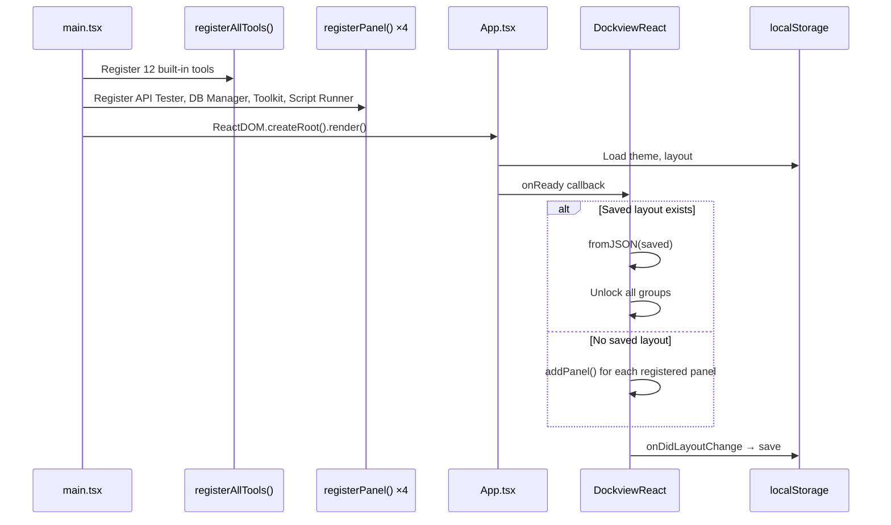
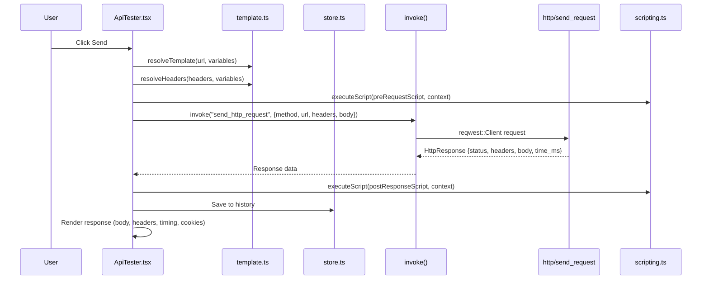
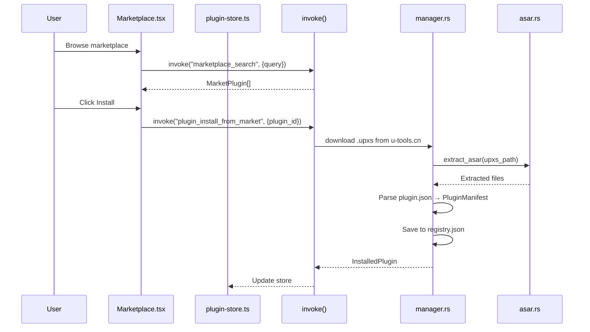
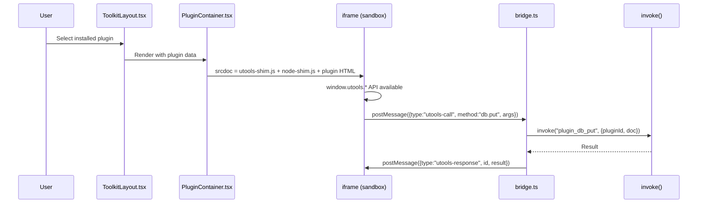
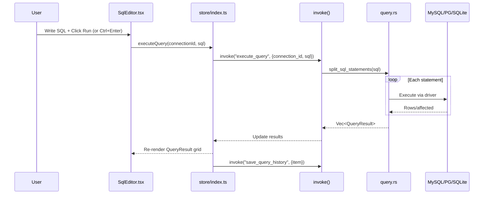
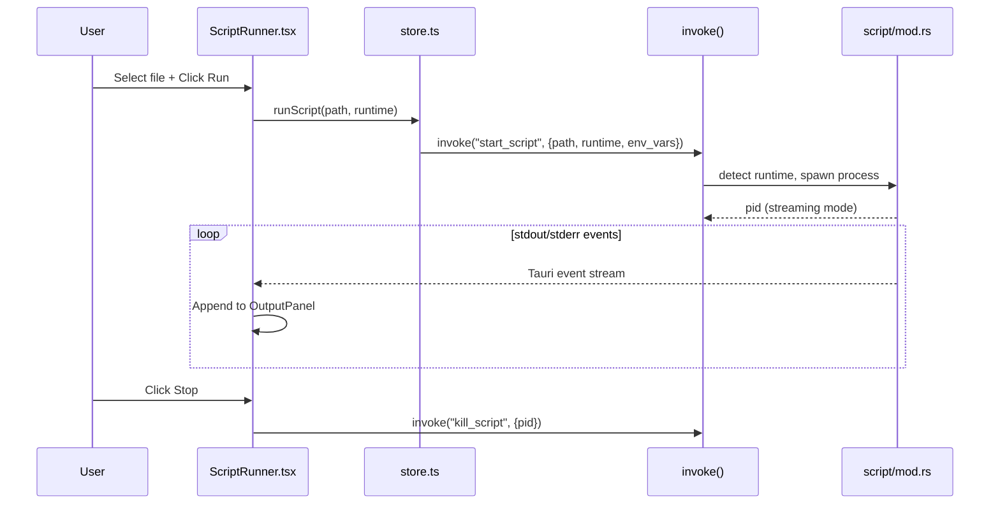
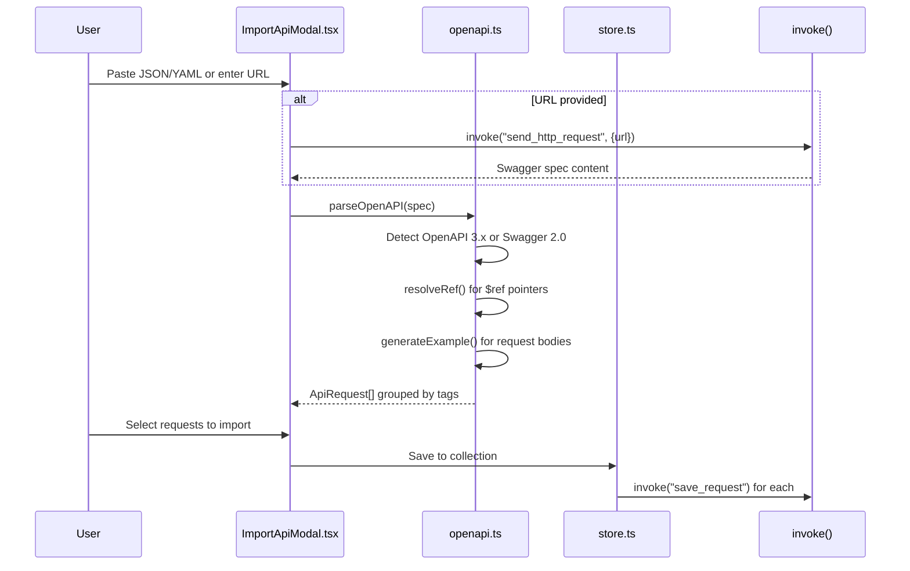
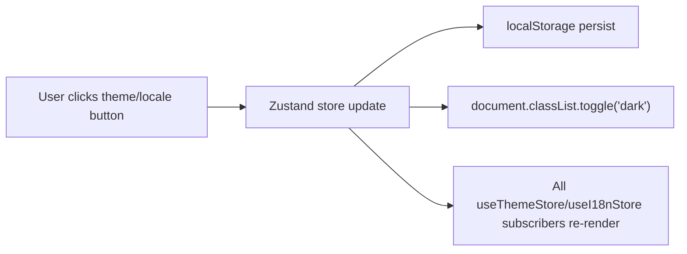

# Key Workflows

## 1. Application Startup

## 2. API Request Execution

## 3. Plugin Installation & Execution

## 4. Database Query Execution

## 5. Script Execution

## 6. OpenAPI/Swagger Import

## 7. Theme & i18n Toggle

