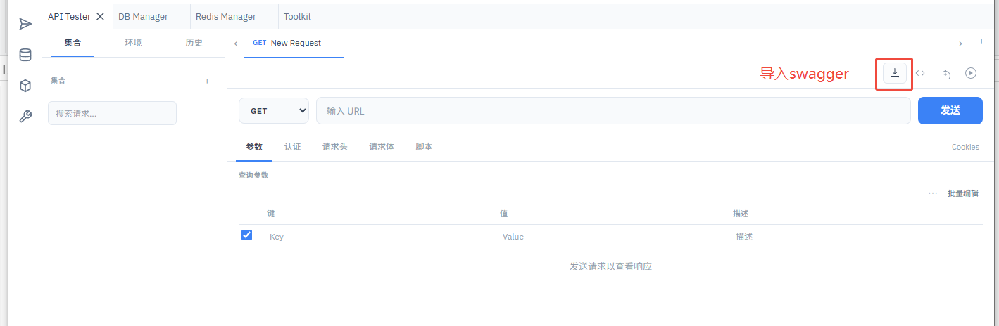
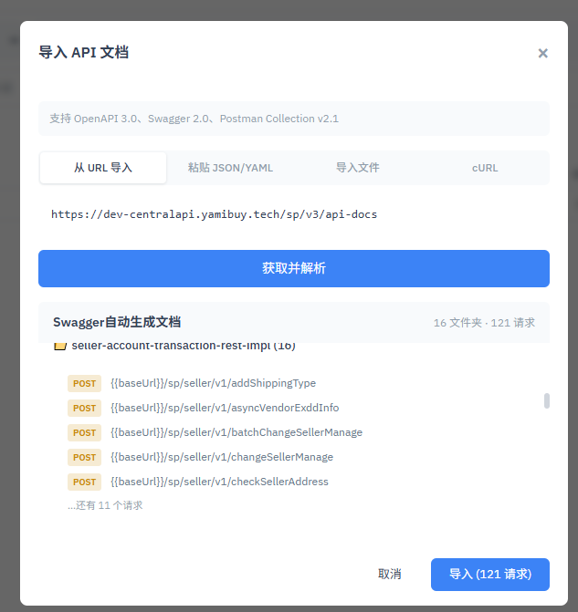
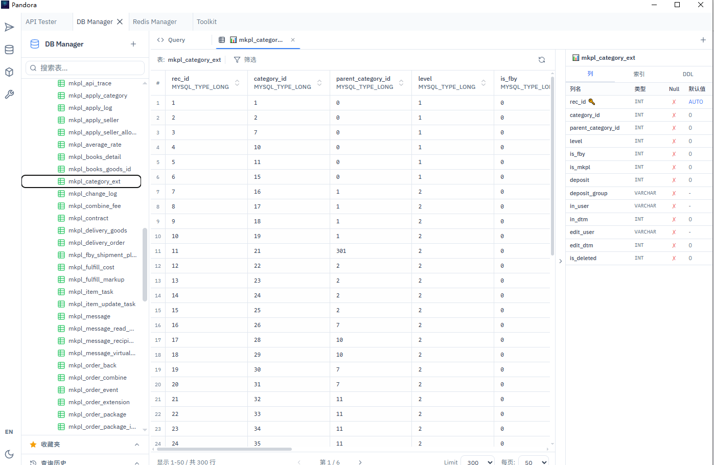
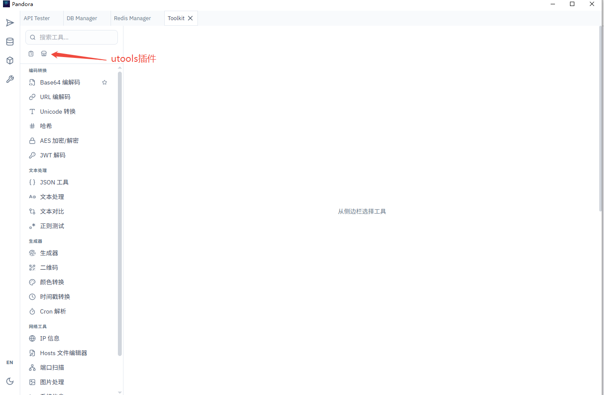

# Pandora

统一开发者工具箱，基于 Tauri 2 构建的桌面应用，采用 IntelliJ 风格的可拖拽面板界面。

## 功能模块

| 快捷键 | 模块 | 说明 |
|--------|------|------|
| `Ctrl+1` | **API Tester** | HTTP 请求构建器，支持集合、环境变量、历史记录、Cookie 管理 |
| `Ctrl+2` | **DB Manager** | 多数据库客户端，支持 SQLite、MySQL、PostgreSQL |
| `Ctrl+3` | **Redis Manager** | Redis 数据库管理，支持键值浏览、命令执行 |
| `Ctrl+4` | **Toolkit** | 开发工具集（编解码、加密、网络、文本）+ 插件系统 |

## 截图

### API Tester

支持 GET/POST/PUT/DELETE 等请求方式，集合管理，环境变量，导入 OpenAPI/Swagger/Postman 文档。





### DB Manager

多数据库连接管理，表结构浏览，数据查看编辑，SQL 查询编辑器。



### Toolkit

内置 20+ 开发工具（编解码、加密、JSON、正则、二维码等），支持 uTools 插件市场。




## 技术栈

- **前端**: React 19 + TypeScript 5.8 + Vite 7 + Tailwind CSS 4 + Zustand 5
- **后端**: Tauri 2 (Rust)
- **布局**: dockview-react（可拖拽/分屏面板）
- **编辑器**: Monaco Editor
- **国际化**: 中文 / English

## 开发

```bash
# 前端开发（仅浏览器）
npm run dev

# 完整应用（需要 Windows PowerShell/cmd）
npm run tauri dev

# 构建
npm run tauri build
```

## 许可证

MIT
